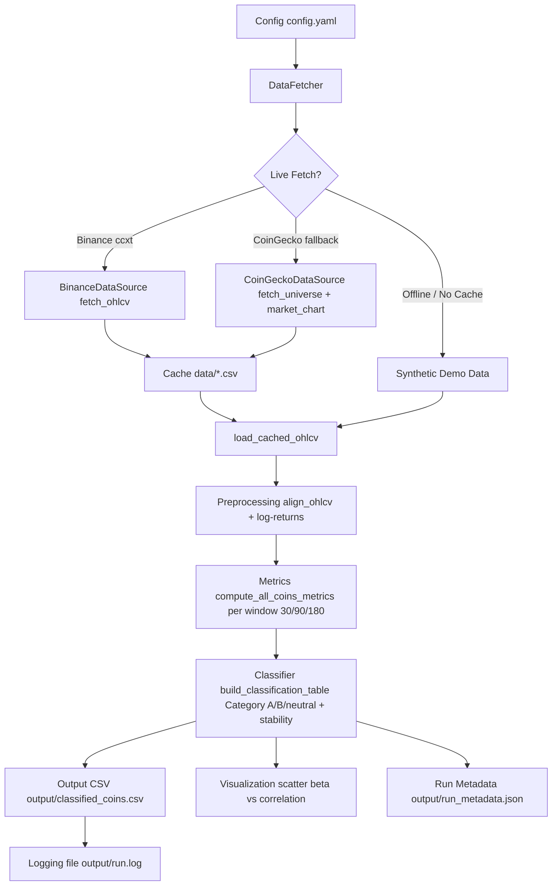

# Architecture — Crypto BTC-Correlation & Beta Filtering System

## Data Pipeline

## Components

| Module | Responsibility |
|--------|---------------|
| `src/data_fetch.py` | Abstraction `DataFetcher` over `BinanceDataSource` + `CoinGeckoDataSource`, universe filtering, OHLCV fallback, cache via `_cache_filename` single source |
| `src/preprocessing.py` | Timestamp alignment, missing-data policy, log-returns `ln(Pt/Pt-1)`, outlier handling |
| `src/metrics.py` | Pearson `r`, beta `Cov/Var`, `R²` + `r_squared_raw` + `regression_method`, p-value, rolling windows, parallel via `ThreadPoolExecutor`/`ProcessPoolExecutor` |
| `src/classifier.py` | `classify_single` with `category_b_require_nonsignificant` flag, `check_stability`, `build_classification_table` (strict threshold contract) |
| `src/config_schema.py` | `validate_config` + `validate_ranges` — no silent defaults, windows ascending, primary_window in windows |
| `src/visualize.py` | Scatter beta vs correlation, threshold lines, Category A shading |
| `main.py` | CLI `--config --seed --offline --synthetic --end-date`, logging file handler, `run_metadata.json` with `config_sha256` |

## Config Contract

- All thresholds in `config.yaml` `thresholds` — missing keys raise `ValueError` (no `.get` defaults).
- `windows` strictly ascending, `primary_window` must be in `windows`.
- `validate_ranges` checks `beta_min <= beta_max`, `alpha in (0,1)`, `corr_low < corr_high` in `[0,1]`.

## No Look-Ahead Bias

Each window uses only data up to time `t` (`iloc[-w:]` for most recent, rolling `start:end`).

## Outputs

- `output/classified_coins.csv` — per-coin `r_*d`, `beta_*d`, `r_squared`, `p_value`, `category`, `stability_flag`
- `output/scatter_beta_corr.png`
- `output/run_metadata.json` — `run_utc`, `config_sha256`, `windows`, `universe_size`
- `output/run.log` — file handler if `logging.file` set
